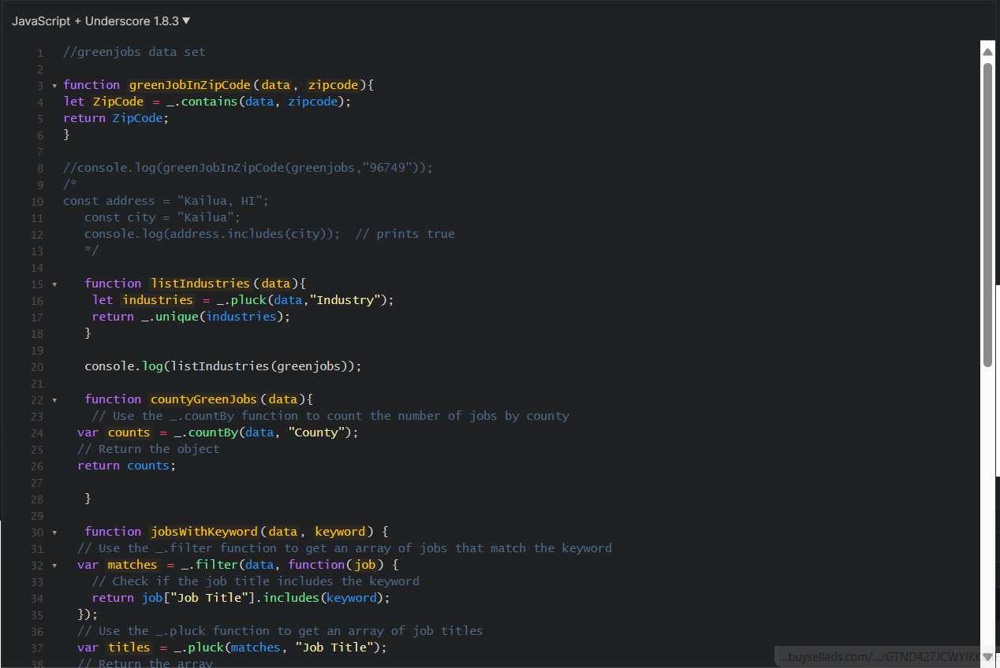

### I. Introduction

AI(Artificial Intelligence) is a tool that simulates human interactions. Using AI can make it easier to research solutions to problems. This is due to AI being able to search and sift through infromtation from the internet to find the answer.
  AI can also help analyze information, such as being able to analyze a basic template for an essay and help give sub-topics in what order  in order to help students write essays. AI is also very helpful to software engineering because it can help pull up reference code for problems from the internet so students can reference it. There are limits to this, based on if the problem has a solution on the internet. Sometimes AI can only pull up similar solutions. This means it is still important for software engineers to still be able to understand the coding concepts used in the code in order to make sure it does what is required.
  Throughout the semester of Spring 2024, I have used AI such as ChatGPT, Bing Copilot, and Google Bard to help with coding and organizing essays.

### II. Personal Experience with AI:
I have used AI in class this semester in the following areas:

  1. Experience WODs e.g. E18
    During Experience WODs, I would usually try to rely on myself and then look at the tutorial afterward. If I still have problems I would ask ChatGPT to analyze the instructions to help give clearer directions. Usually experience WODs focus on trying new things so ChatGPT is almost useless in helping the user, unless the user has at least a basic understanding of what they're doing.
  2. In-class Practice WODs
     When working on practice WODs, using ChatGPT is only useful in certain circumstances. For example, directly asking for the answer for basic JavaScript coding problem is possible to get the direct answer immediately. This just requires code testing since the code is basically taken from somewhere else online. However, when coding HTML code, the ChatGPT is only capable of creating a template of what is required. Practice WODs have a time limit which range from 20 minutes to an hour. So if I truly was lost on what to do, I would try using ChatGPT for the answer.  
  3. In-class WODs
    Similar to inj-class practice WODs, I would use AI to either try and get the answer directly, but it would not always work. 
  4. Essays
    For essays I would usually try to avoid, or just not use AI. For essays the most I would do would be to scan the text prompt and create a template of sub topics and layout for my essay. Then I would fill in the essay by myself.
  5. Final project
    I did not use AI for the Final Project, since I mainly focused on reusing old code from previous assignments. 
  6. Learning a concept / tutorial
    AI is very helpful in understanding concepts. When I was learning about how to fix errors in code. The error messages are not always the most descriptive. This led to using ChatGPT to give an in depth description of what the error message is and how to solve it. It can also be used to describe, different coding concepts such as AI. The beginning definition of AI is based on what AI is according to ChatGPT.
  7. Answering a question in class or in Discord
    In ICS314 we were actually encouraged to use AI to learn about questions posed in class. Using AI does give a in depth explanation of the concepts being asked about. However, I also learned that when using different AI systems, results can vary. Sometimes there is a little difference, but it can also be to the point where the answers of different AI systems contradict. This is due to the limitations of AI, in that AI can only give answers based on the internet. If internet articles are incorrect, AI will give an incorrect answer.
  8. Asking or answering a smart-question
    Using AI to ask a smart-question is sometimes useful, however usually the best answer comes from a link to a message board
  9. Coding example e.g. “give an example of using Underscore .pluck”
    As seen in the picture above, ChatGPT was used to create the code in greenjobs using a .pluck function.
  10. Explaining code
    I used ChatGPT to help analyze code, and the functions of different functions of code only when looking at JavaScript functions.
  11. Writing code
    Asking ChatGPT write code is easy for simple functions, however it is close to impossible for an exact answer when creating a webpage on an HTML file. When creating an HTML file, the AI doesn't have access directly all the time so it can create strange code sometimes. So the website doesn't look correct. I learned that formating a HTML file still requires user knowledge to create correctly. AI can only at most give a template.
  12. Documenting code
  I don't use AI to document code. I just do all the documentation by myself.
  13. Quality assurance 
  AI doesn't necessarily always assure quality dues to not always seeing everything, but it is still helpful in providing hints about what changes could be made based on user input.
  14. Other uses in ICS 314 not listed above
  I would usually use AI to learn about concepts mainly math or physics problems that I find difficult to analyze quickly.

### III. Impact on Learning and Understanding:
AI is a very helpful tool when used properly. What I consider proper use is using Chat GPT to solve a problem step by step and showing the process to better understand. Of course, AI is very likely to be used improperly, just giving the direct answer. The direct answer doesn't help in learning, but learning the process of how to tackle a problem is very helpful.

### IV. Practical Applications:
I used AI to try and fix the problem of how my computer was not using 'mup' properly. 'mup' is a method to deploy an internet program. I was using ChatGPT to try and figure out what was wrong with my computer setup. In the end I was able to go through several steps of updating my node to the most current node, and ChatGPT gave concise directions of what to do, and how to do it. This was done using commands given by ChatGPT in the command prompt.

### V. Challenges and Opportunities:
AI can only learn so much and help so much on computer problems. I would usually use ChatGPT, Google Bard, or Bing Copilot. ChatGPT is what I usually like to rely on, but the version I was using can not analyze pictures. Although Google Bard and Bing Copilot can analyze pictures, most coding doesn't require pictures to analyze problems. I once tried to use Google Bard to help in a HTML file setup, to setup the file in a similar format to the picture based on meteor, however it created a very complicated code structure that did not work. The code did not create the desired HTML file format.

### VI. Comparative Analysis:
I prefer ChatGPT for help in coding due to it being able to usually create code, and respond to requests to changes of the code relatively well. Although when trying to understand a conceptual problem based on a picture, I would use Google Bard. Google Bard does a good job analyzing conceptual problems, but sometimes gives the wrong answers in coding.

### VII. Future Considerations:
I believe that the future of AI is a very helpful tool that will probably be able to replace most coding positions, due to its high flexibility in creating code based off of already existing code. Although, it is still important to have people to always double check the AI. Since any answers of AI is based on pre-existing information, if the infromation is incorrect, the AI will draw incorrect solutions.

### VIII. Conclusion:
In conclusion, AI is a very helpful tool in coding. However, it is only a useful tool at helping to learn how to code if used in a certain way. Learning the process is very important for learning, and AI can teach the process, but it can also just spit out the answer as well.
