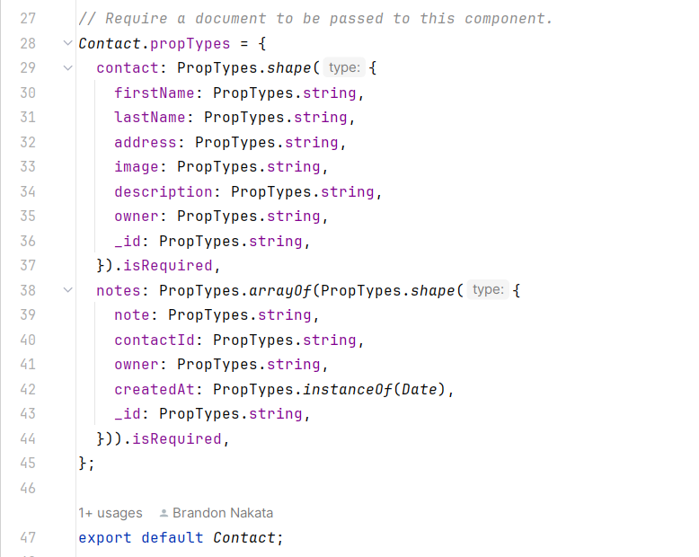
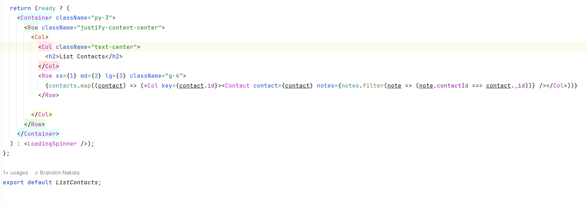

# Design Patterns in Software Engineering
*Design Patterns: communicating objects and classes that are customized to solve a general design problem in a particular context.*

There are many types of software programs that tackle the same types of problems. So many times using a template of code to accomplish a similar or the same task is useful in order to decrease the amount of time needed for coding. There are many ways to create a design pattern, but preferably the pattern should be flexible enough for the overall structure to be useful in similar cases.

## Types of design patterns

There are three types of design patterns which are:

<ul>
  <li>Creational</li>
  <li>Structural</li>
  <li>Behavioral</li>
</ul>

### Creational Design Pattern

Creational design patterns abstract the instantiation process. They help make a system independent of how its objects are created, composed, and represented. A class creational pattern uses inheritance to vary the class that’s instantiated, whereas an object creational pattern will delegate instantiation to another object. [1]

Some methods that creational design include factory, singleton, prototype, and builder.

The factory method can create objects without specifying an exact class the object will be created. This is most useful when using multiple classes with similar structures.
The singleton method makes a class only have one instance. So there is no other instance to conflict with the execution of the program.
The prototype method is to create an object by copying another object. So basically code to create one object, then everything else is copied based on the object. Or a riskier method would be to let the program copy the copy, but more things can go wrong if this were to occur.
The builder method is to separate the builder function from the definition of the object's class.

### Experience with Creational Design

I personally feel that creational design is a very useful method to make creating code easier. However, creational design pattern basically requires the coder to map out the full strucure of the code before hand. Such as deciding what the overall structure of the entire code will be like, and what the code in the design will accomplish for each different part. Since the code can be abstract it is important to name them properly to keep track of the data, and which data is being used.

An example of creational design I used was in the program digits which was created to build a database of contacts and be able to display the contacts in the database to the account that created the contact. A picture of the contact list is shown below.

The code uses a builder method in order to create an instance for a new contact. The contact data structure is built separately from the builder. In the code, there is a 'Contact' data structure which will define the contact's first name,  last name, address, description, and picture. The builder has a function that can build contacts for the contact list based on the 'Contact' structure. The picture shows the 2 different contacts that added to the contact list to display. The builder method is based on adding the information to the picture below and submitting the information to be created and sent to the database.

### Structural Design Pattern

Structural Design Patterns are concerned with how classes and objects are composed to form larger structures. Structural class patterns use inheritance to compose interfaces or implementations. [2] 

### Experience with Structural Design Pattern

An example of a structural design is when coding a program to define the structure of a class. During the semester when working on the digits project there was a list contact page, which will display the contacts associated with the account. The end result is shown in the picture below.

Below is the structure of Contact. The structural design part is associating the 2 components of contact and notes to the Contact. So every Contact will have the contact information and teh notes associated with the Contact.

### Behavioral Design Pattern

Behavioral Patterns are concerned with algorithms and the assignment of responsibilities between objects. Behavioral patterns describe not just patterns of objects or classes but also the patterns of communication between them. These patterns characterize complex control flow that’s difficult to follow at run-time. [3]

So basically the behavioral design focuses on how different classes, objects interact with each other.

### Experience with Behavioral Design Pattern

An example would be in digits.

In order to code to build the web page it is important to understand the ContactsList which will hold the members of contacts. Then setup the webpage to display the code based on the structure of the contact. Below is a picture of the code ListPage returns. Which is basically returning the contact and the notes associated with the contact.

The code shows that the Contact will take 2 items from 2 different lists of contacts and notes. The contacts list will only return if the userId is associated with the logged in account.

Below is a picture of the structure of the Contact and the parts of the contact and notes. There is a hierarchy between the data components. The contact has components of firstName, lastName, address, image, description, owner, and id. The notes has a component of note, contactId, owner, and CreatedAt. Then the overall belongs to the Contact.

The picture shows that the Contact is composed of a component called contact and a component called notes. This is how structural design can be used to link 2 different objects with different classes using a hierarchy. The Contact is what holds contact and notes in its data structure.

# Conclusion

Design patterns are an important part of coding in order to be able to reduce the time needed to code.
This is accomplished by using either flexible code that can instantiate different classes or being able to see how different objects and classes interact with each other.

# References

[1] "Creational Design Patterns." GeeksforGeeks. <a href="https://www.geeksforgeeks.org/creational-design-pattern/">https://www.geeksforgeeks.org/creational-design-pattern/</a> 

[2] "Structural Design Patterns." GeeksforGeeks. <a href="https://www.geeksforgeeks.org/structural-design-patterns/">https://www.geeksforgeeks.org/structural-design-patterns/</a> 

[3] "Behavioral Design Patterns." GeeksforGeeks. <a href="https://www.geeksforgeeks.org/behavioral-design-patterns/">https://www.geeksforgeeks.org/behavioral-design-patterns/</a> 

