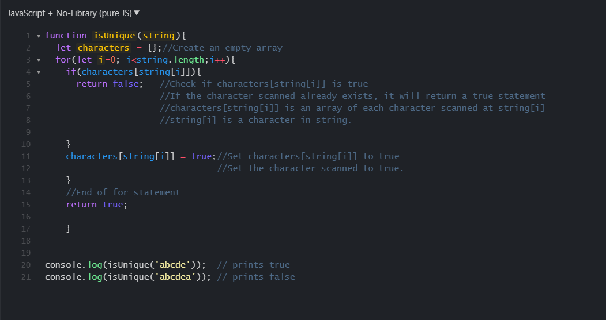

# The Importance of Design Patterns in Software Engineering
*Design Patterns: communicating objects and classes that are customized to solve a general design problem in a particular context.*

There are many types of software programs that tackle the same types of problems. So many times using a template of code to accomplish a similar or the same task is useful in order to decrease the amount of time needed for coding. There are many ways to create a design pattern, but preferably the pattern should be flexible enough for the overall structure to be useful in similar cases.

## Types of design patterns

There are three types of design patterns which are:

<ul>
  <li>Creational</li>
  <li>Structural</li>
  <li>Behavioral</li>
</ul>

### Creational Design Pattern

A creational design pattern is when the system abstracts the code from the instance. This would be like creating a class to define the setup of the code. Yet also creating a subclass of the class and defining the method to generate members of the class in the subclass.

#### Experience with Creational Design

I personally feel that creational design is a very useful method to make creating code easier. However creational design pattern basically requires the coder to map out the full strucure of the code before hand. Such as deciding what the overall structure of the entire code will be like, and what the code in the design will accomplish for each different part. Since the code can be abstract it is important to name them properly to keep track of the data, and which data is being used.

An example of creational design I used is in <a href="https://businessbonders.xyz/">Business Bonders</a>

### Structural Design Pattern

Structural design patterns are 

<!--  -->

# References

1. "Creational Design Patterns." GeeksforGeeks. <a href="https://www.geeksforgeeks.org/creational-design-pattern/">https://www.geeksforgeeks.org/creational-design-pattern/</a> 

2. "Structural Design Patterns." GeeksforGeeks. <a href="https://www.geeksforgeeks.org/structural-design-patterns/">https://www.geeksforgeeks.org/structural-design-patterns/</a> 

3. "Behavioral Design Patterns." GeeksforGeeks. <a href="https://www.geeksforgeeks.org/behavioral-design-patterns/">https://www.geeksforgeeks.org/behavioral-design-patterns/</a> 

