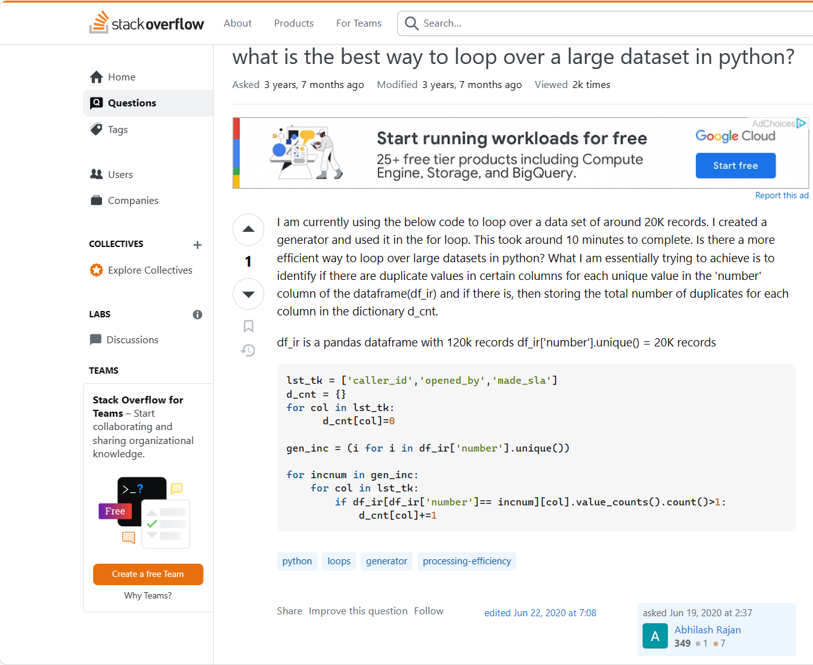

# *How Smart Questions help engineers*

## What are Smart Questions?

Smart Questions is a technique of asking questions to get help to solve technical problems. To ask Smart Questions through online forums, it is important to be specific in what you are asking, and that the question relates to the place you're asking the question.

## How to determine if a question is a Smart Question?
#### According to [Eric Raymond and Rick Moen](http://www.catb.org/esr/faqs/smart-questions.html), smart questions are: 
 - Specific about what is being asked. Such as stating the goal of the problem directly.
 - Precise, and not open ended.
 - Describe the problem in chronological order to better describe what went wrong at what time.
 - Don't ask others to debug code unless you give a hint on what the problem is.
 - Not just directly stating a homework problem.
 - Don't just state "I don't know what is wrong."
 Questions that can be easily answered by looking into the manual, easily found on the internet search is not a smart question. Smart Questions is a way to better ask questions from experts to let experts understand the problem and help you understand the nature of the problem.

# Examples
## Smart Questions on Stack Overflow.

### Hangman Example (Java)
An example of a not so smart question is on stack overflow.[https://stackoverflow.com/questions/21058626/why-is-my-code-not-working-as-intended](https://stackoverflow.com/questions/21058626/why-is-my-code-not-working-as-intended) Basically the code is a hangman game code written in Java. The problem is that the code constantly outputs an incorrect signal when the answer is correct. The question the author posted simply stated "Why is my code not working as intended?" Even though according to the basis of the question is not according to the Smart Question standard. The author did state the problem closer to the end of the post. The code constantly outputs that the answer input is wrong even when the answer is correct. The post that responded showed that the comparison operation used was a '==' which is okay to compare simple datatypes like int, float, char, etc. However strings are not stored as simple datatype. To compare strings, it is necessary to the .equals() command on the strings. Even though the question did not meet the smart question standard of how the base question was formatted, the author of the post did explain in detail of what was wrong with the code the resulting error which is part of the smart questions guidelines.

### Data set example (Python)
An example of a smart question on stack overflow. [https://stackoverflow.com/questions/62462402/what-is-the-best-way-to-loop-over-a-large-dataset-in-python](https://stackoverflow.com/questions/62462402/what-is-the-best-way-to-loop-over-a-large-dataset-in-python) The question is "what is the best way to loop over a large data set in python?". In the post it describes the code of a for loop in python that runs through 20K 'records'. The code took 10 minutes to compile and run. The code picture shows there are 4 for loops being used. The author of the question is asking for a method to make the code more efficient. The comments that responded, pointed to a for loop used to compose another list of unique records, however no real help came from it. The question is basically open ended for methods to increase effieciency. A proposed solution was to try and merge some of the for loops to reduce the need for extra steps.

# Conclusion
Overall, the smart questions standard set by Eric Raymond and Rick Moen is an okay guide to follow when asking technical questions on forums. Based on the 2 previous examples used. The Hangman Example is not a smart question according to the standard because the of asking "why is my code not working as inteded?" in the title. However, I feel that due to the explanation of the code and the problems within the code it closely resembles a smart question to the point it practically is. The Data Set Example in python is kind of like a Smart Question in that it shows and explains the code. The code is in python and the author is looking for efficiency methods to help speed up the code. Even though it follows the smart code standard no solution was found. This leads me to conclude that as long as a question is specific in what the symptoms of the problems are, there is a higher chance of a solution or clues to a solution on a forum.
