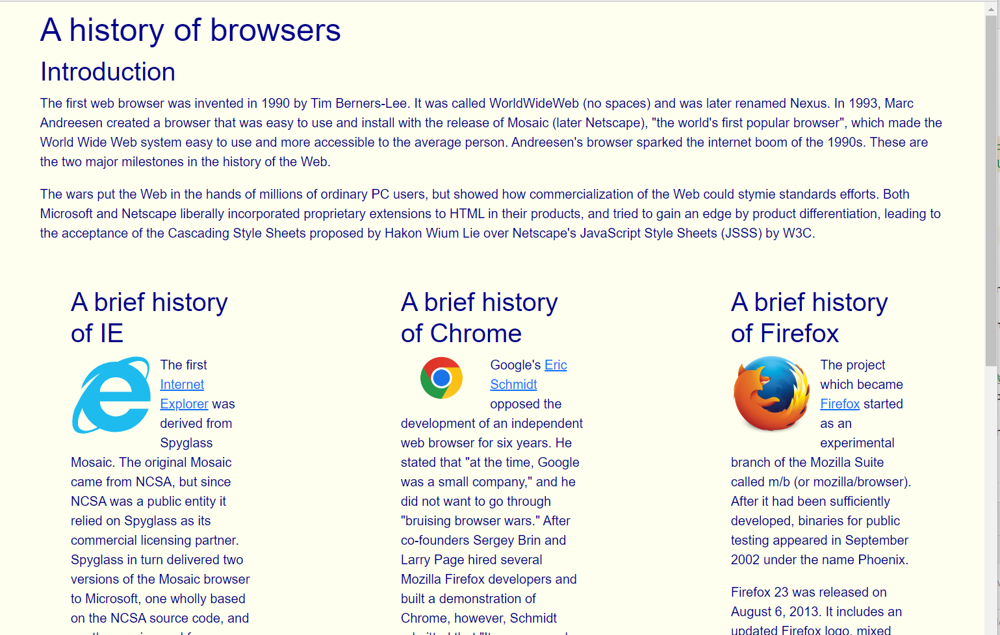
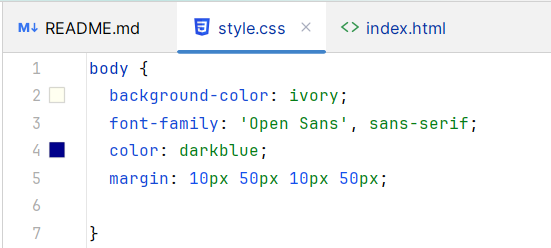
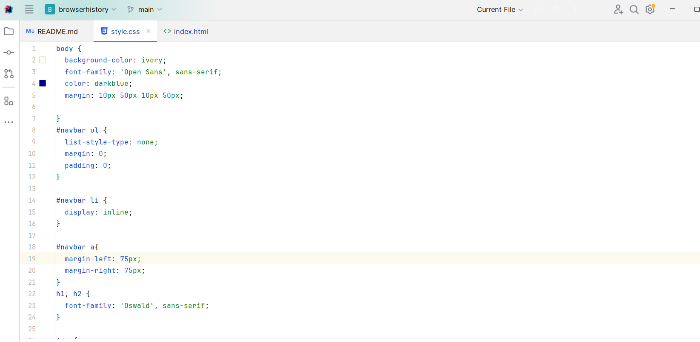
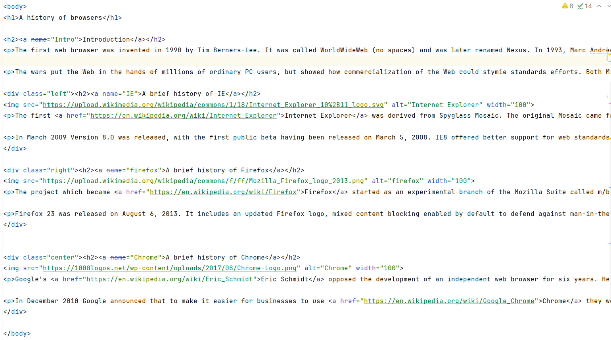
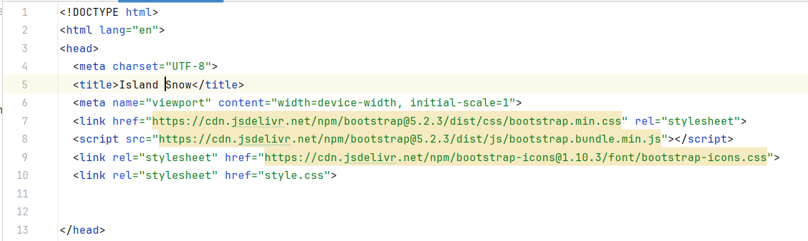
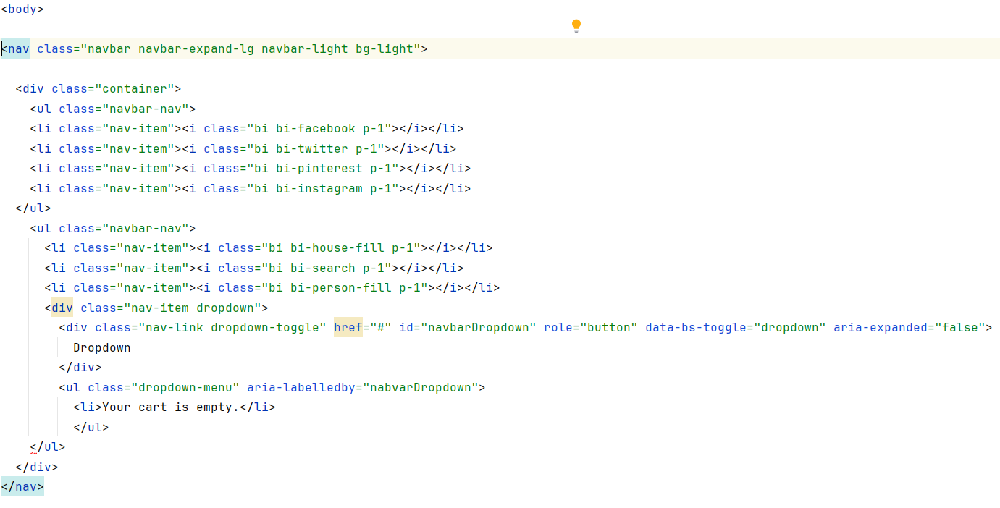
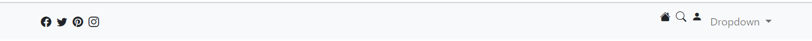

# Importance of UI Frameworks

UI(User Interface) Frameworks are prebuilt libraries used to create user interfaces for code. The feature these libraries include are buttons, text color and fonts, and adjusting the alignment of texts and pictures. 

<h3>
The Significance of UI Frameworks in Web Development
</h3>

The UI Framework libraries are important in reducing the time needed to organize certain function of a web page such as buttons, organizing data display placements and sizes. The framework for user-interface could also be done from scratch in a html and css file, however it would multiply the time needed to complete the final product.

# Experience with HTML and CSS
My experience with <a href="https://www.w3schools.com/html/">HTML</a> and CSS is very straight forward. The HTML file will hold the basic layout of the webpage. The parts of the html can be assigned classes, or just use the component as is in the CSS. The class or part used in the CSS can be given definitions of what type of style the code can get Such as colors, fonts, margins, size, etc.
### Example of using HTML with CSS without BootStrap

My experience with using HTML to organize the user interface of a browser history webpage. My browser history website is made up of an HTML file and a CSS. The html file basically organizes the content and what the content of the webpage is. The CSS file will stylize the webpage content. The style it went with is an ivory colored background with a dark blue text color.

The picture above shows the picture of my browser history file using html file. This was not done with bootstrap. A picture of the style of the body from the CSS file can be shown in the picture below. The file shows the body in being assigned a background-color of ivory, a font of sans-serif, and a color of dark blue. This can show how the CSS file works to change the style of the webpage. The margin is set so the body has 10 pixels from the top, 50 pixels from the right, 10 pixels on the bottom, and 50 pixels on the left.

<!--

-->

The part below shows the part of the code in the body of the html file. Basically The top of the page introduces a header called "A history of browsers" which is then followed by the introduction to the webpage. The main topics covered on the webpage are internet explorer, chrome, and firefox. The 3 main points will be divided with a div and given a class.

# Experience with BootStrap

Bootstrap is very useful, in that it acts like a CSS file with predefined classes with styles that are already defined. It can reduce the time needed since you do not need to define the style. However, it can be difficult to get started in learning the types of styles that will be used and learning the specific class names. A found the most useful was creating a navigation bar using bootstrap. Navigation bars are more complicated without bootstrap. With bootstrap, all you have to do is create a container and create a <b>nav</b> code and then fill it out with <b>nav-item</b>s. 

### Example of using Bootstrap

An example of using Bootstrap was used in the island snow example shown below. In the island snow example, a navigation bar was implemented using bootstrap-5. The bootstrap-5 is using an online link as a source shown in lines 6 to 9 in the picture below. This means without a connection to the internet, the bootstrap-5 references will not work. The way the bootstrap is used in shown in the body portion of the code.

The code shown below is the body part of the <b>island snow</b> code showing the implementation of a navigation bar. The code uses an initializer called <b style="color: blue">nav</b> inside the body and assigns it the class assigning the class <b style="color: green">navbar navbar-expand-lg navbar-light bg-light</b>.. Then creating a <b style="color: blue;">div</b> initializer with a class called <b style="color: green">container</b>. Overall, the way that bootstrap-5 works is by having predefined classes that can be used in the code to have a certain file format. The classes that are defined, that are shown in the picture below are shown in green.

The picture below shows the result of the navigation bar created based on the code above. Based on the code, there are 2 <b style="color: blue">ul</b> sets, which show the left and right side of the navigation bar. The left part of the navigation bar shows the icons of facebook, twitter, pinterest, and instagram. The right side of the navigation bar is defined in the lower <b style="color: blue">ul</b>, which has a house icon, search glass icon, person icon, and a dropdown button. The dropdown will also create a box showing that will display the <b>"Your cart is empty"</b>.

<h1>Conclusion</h1>

Overall the use of UI frameworks, makes creating webpages easier to create and organize code on a webpage. It just takes time to learn more about the different classes defined in the library. Similar to other libraries in coding languages, there are many predefined terms that need to be learned to best utilize bootstrap.
