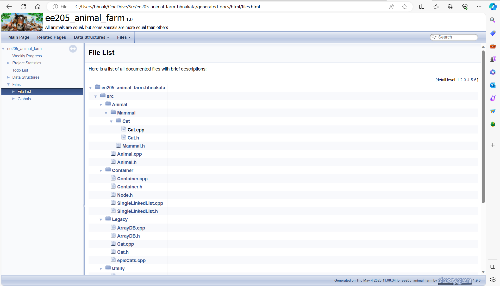

# Animal Farm
Animal Farm was a school project that was done in EE 205 at UH Manoa. EE 205 is the object-oriented programming course. The goal of the Animal Farm project was to create a database of code that can use classes and subclasses in C++. I created the code for operating the Animal Farm structures, such as the classes. The basics of the project was to create an Animal class that can take in a data structure of an Animal. The Animal class has sub components that describe gender, weight, and name(for a pet). There is a sub class for mammal under animal that is designed to only take in animals.

During this project, I learned how data structures can be used together to make code from several files work together. and learned about Doxygen. Doxygen is a tool which is helpful to document code in a tidy way. Doxygen helped me visualize the data structures I created, and how they link together. During the course of this project I used CLion, an Integrated Development Environment that is useful to cross different platforms. The CLion features easy edit options, which can highlight variables that I am highlighting over, so the connection between code is easier to see.
