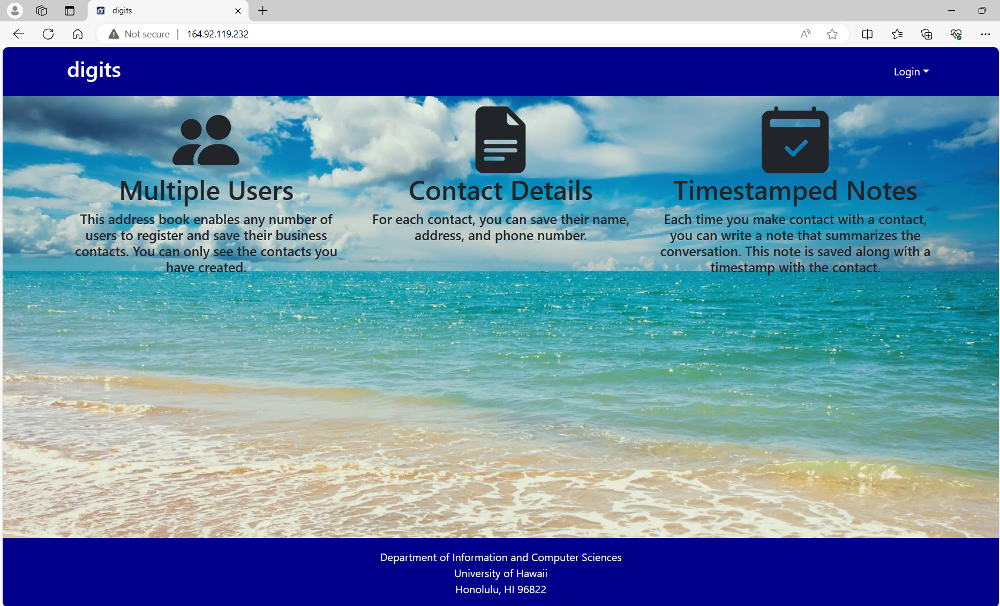

For the ICS 314 class created a file called Digits, with the purpose of being able to store personal contacts of users. The contacts has basic info of name, address, description, and timestamped notes about contact. I created this project based on the guidelines with minor styling added to it. The customized background image of the beach is meant to give it a more personal feel from Hawaii.

This project is located on my github in a private session at <a src="https://github.com/bhnakata/digits">https://github.com/bhnakata/digits</a>. Need to contact me to ask for permission to access it.

