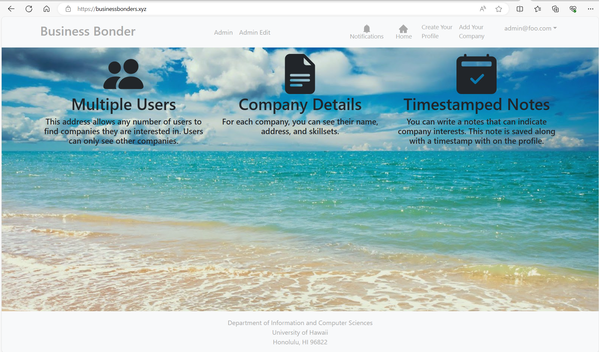

<h1>Business Bonders</h1>

Created a project that focuses on connecting students with companies. Using a template to cut down on work. I mainly focused on creating the website's deployment on Digital Ocean. Digital Ocean is a website that specializes in helping programmers post websites online with a unique URL. Then I created a domain name of <a src="https://businessbonders.xyz/">https://businessbonders.xyz/</a>.

